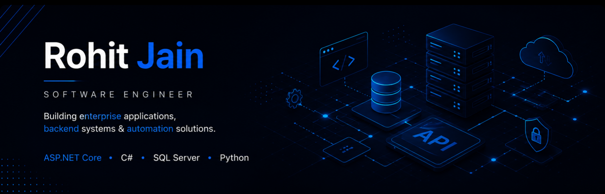

  

<h1 align="center">Hi 👋 I'm Rohit Jain</h1>

<b>Software Engineer | Backend Developer</b>

ASP.NET Core • .NET 8 • C# • SQL Server • Python

Building enterprise software, backend systems and automation solutions.

---

## About

I'm a Software Engineer currently working on the development of a university-wide Enterprise Resource Planning (ERP) system using **ASP.NET Core MVC (.NET 8), C# and SQL Server**.

I enjoy designing backend systems, solving complex business problems and building software that remains maintainable as requirements evolve. My interests include backend engineering, database design, performance optimization, automation and software architecture.

Outside of work, I enjoy reverse engineering systems, exploring APIs and building automation tools that solve practical problems.

---

## Current Focus

- 🏛 Enterprise ERP Development
- ⚙ Backend Engineering
- 🗄 SQL Server & Database Design
- 📄 Workflow & Document Management
- 📈 Performance Optimization
- 🔒 Secure Application Development

---

## Featured Projects

### 🏛 Enterprise ERP *(Production Project)*

Contributing to the development of a modern university ERP serving multiple academic and administrative departments.

**Highlights**

- Research Management Module
- Multi-Level Approval Workflow
- Secure Document Management
- Role-Based Access Control
- Email Notification Framework
- Hostel Management
- Transport Management
- Performance Optimization

> Source code is proprietary and cannot be shared publicly.

---

### 🤝 Talent & Skills Alliance

A collaborative platform that helps students and professionals find teammates for hackathons and software projects.

**My Contribution**

- Flask microservice
- MongoDB integration
- Automated sentiment analysis
- Google Gemini API fallback
- AI-generated review summaries

---

### 📈 JioMart Price & Stock Alert

Automation platform built after reverse engineering JioMart APIs.

- Price tracking
- Stock monitoring
- Google Sheets integration
- HTML email alerts
- Cloud automation

---

### 📶 University WiFi Auto Login

Automation utility that automatically detects WiFi disconnections and performs seamless re-authentication without user intervention.

---

### 🎵 Spotify Playlist Automation

Automation scripts using Spotify APIs for playlist synchronization and scheduled updates.

---

## Technical Skills

| Category | Technologies |
|----------|--------------|
| **Languages** | C#, Python, SQL, JavaScript, HTML, CSS |
| **Backend** | ASP.NET Core MVC (.NET 8), Entity Framework Core, LINQ, Flask, REST APIs |
| **Database** | SQL Server, MongoDB, SQLite |
| **Frontend** | Razor Views, Bootstrap, JavaScript, AJAX |
| **Tools** | Git, GitHub, Visual Studio, SSMS, IIS, Jira, Postman |

---

## Engineering Principles

- Build solutions that remain maintainable as requirements evolve.
- Prefer reusable components over one-off implementations.
- Design with scalability and performance in mind.
- Solve the underlying problem instead of only the immediate requirement.
- Keep software simple wherever possible.

---

## Currently Learning

- ASP.NET Core Web APIs
- Docker
- Redis
- Azure
- Unit Testing (xUnit)
- System Design
- Distributed Systems

---

---
## GitHub Activity

---

## Connect

📧 **Email**

**jainr.j555@gmail.com**

💼 **LinkedIn**

https://linkedin.com/in/rohitj921

🐙 **GitHub**

https://github.com/rohitj921

---

<i>"Good software is built one thoughtful decision at a time."</i>

